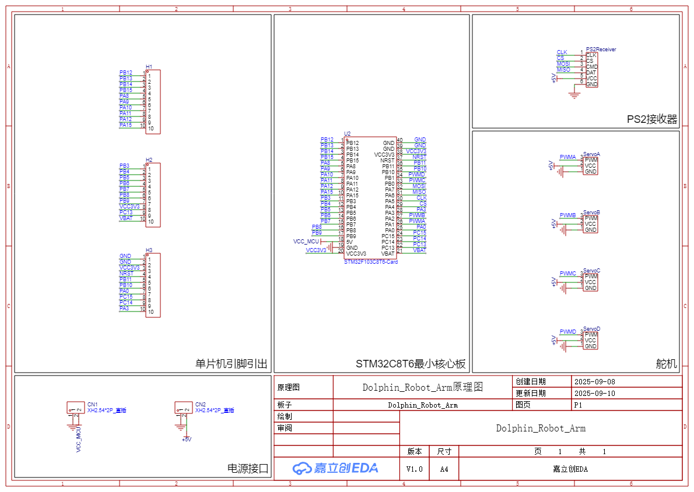

# 🐬 Dolphin Robot Arm

> 基于 STM32F103C8T6 + PS2 手柄的 3 自由度桌面海豚机械臂（包含 SW 模型） 

---

## 📷 项目预览

 
 

[🎥 点击观看演示视频](https://www.bilibili.com/video/BV1tHa8zaEXb/?spm_id_from=333.1387.homepage.video_card.click&vd_source=a3d79e63ae261ce278c12c5cd8c60479)

---

## 💻 装配视频 
### 视频教程需要付费，作者本人也是跟着视频教程学习的，如无学习建模需求，建议对照本项目的装配体文件自行装配 
[🎥 点击跳转装配教程](https://www.bilibili.com/cheese/play/ep34546?query_from=0&search_id=16798930185137633368&search_query=%E9%98%BF%E5%A5%87%E8%AE%BE%E8%AE%A1%E5%88%86%E4%BA%AB&is_PCend=1)

---

## 接线图&原理图 

